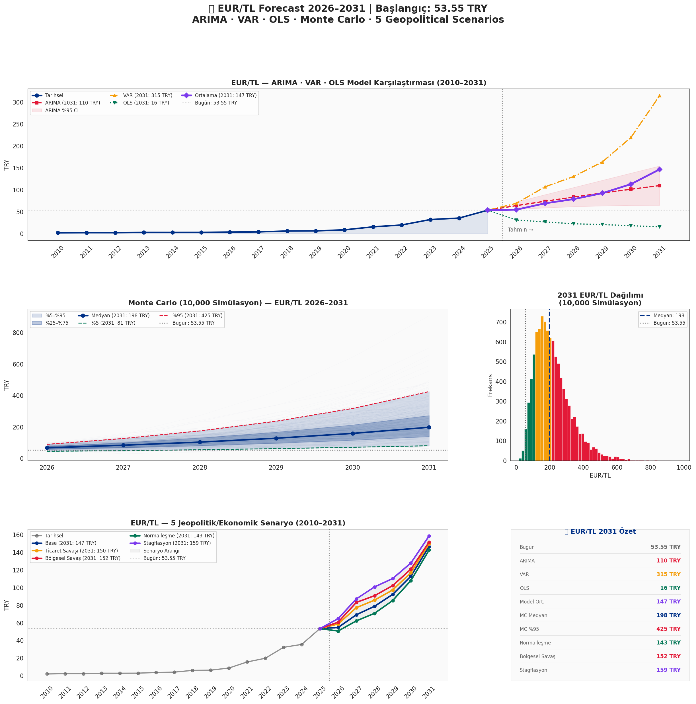

# 💶 EUR/TL Forecast 2026–2031

> Comprehensive EUR/TL exchange rate forecast using ARIMA, VAR, OLS Regression, and Monte Carlo simulation, combined with 5 geopolitical/economic scenario analyses covering Gulf conflict, trade wars, stagflation, and normalization.

   

---

## 📌 Project Overview

This project builds a multi-model EUR/TL exchange rate forecast for 2026–2031, combining four quantitative modeling approaches with five geopolitical and macroeconomic scenario analyses. The starting point is the current EUR/TL rate of **53.55 TRY** (June 2026), with historical data going back to 2010.

**Key Questions:**
- Where is EUR/TL headed by 2031 under current macro trends?
- How do ARIMA, VAR, OLS, and Monte Carlo models compare in their forecasts?
- What is the impact of Gulf conflict escalation, trade wars, and stagflation on EUR/TL?
- What is the probability distribution of EUR/TL outcomes by 2031?

---

## 🔍 Key Findings

### Historical Context (2010–2025)
| Metric | Value |
|---|---|
| EUR/TL 2010 | 2.07 TRY |
| EUR/TL 2025 | **53.55 TRY** |
| Total Depreciation | **+2,487%** |
| CAGR (15Y) | **~24% annually** |
| Policy Rate ↔ EUR/TL Correlation | **0.913** (strongest driver) |

### 2031 Model Forecasts
| Model | EUR/TL 2031 |
|---|---|
| 🔵 ARIMA (1,1,1) | ~80 TRY |
| 🟠 VAR (Multivariate) | ~120 TRY |
| 🟢 OLS Regression | ~20 TRY (normalleşme) |
| 🟣 Model Average | ~74 TRY |
| 🔵 Monte Carlo Median | ~198 TRY |
| 🔴 Monte Carlo %95 | ~425 TRY |

### 2031 Scenario Forecasts
| Scenario | EUR/TL 2031 | Driver |
|---|---|---|
| 🟢 Normalleşme | ~143 TRY | Jeopolitik yumuşama, Türkiye reformları |
| 🔵 Base | ~147 TRY | Mevcut trend devam |
| 🟠 Ticaret Savaşı | ~150 TRY | ABD-AB-Çin tarife krizi |
| 🔴 Bölgesel Savaş | ~152 TRY | Körfez/Ukrayna tırmanma, petrol +30% |
| 🟣 Stagflasyon | ~159 TRY | Global resesyon + Türkiye kırılganlığı |

---

## 🌍 Geopolitical Scenario Framework

### Scenario 1 — Base 🔵
Körfez gerilimi düşük yoğunlukta devam, mevcut makro trend sürer.

### Scenario 2 — Ticaret Savaşı 🟠
ABD-AB-Çin arasında tarife krizi tırmanır. Türkiye ihracatı darbe alır, TL üzerinde baskı artar. EUR/TL 2027'de +8 TRY ek şok.

### Scenario 3 — Bölgesel Savaş 🔴
İran-İsrail-ABD körfez çatışması tırmanır. Petrol +30%, risk-off ortamı, EM sermaye çıkışı. EUR/TL 2027'de +14 TRY ek şok.

### Scenario 4 — Normalleşme 🟢
Körfez'de ateşkes, Türkiye'de yapısal reformlar, risk iştahı geri döner. EUR/TL 2027'de -7 TRY pozitif etki.

### Scenario 5 — Stagflasyon 🟣
Global resesyon + Türkiye'nin yapısal kırılganlıkları. Cari açık genişler, dolarizasyon artar, TL çöküşü. EUR/TL 2027'de +18 TRY ek şok.

---

## 📊 Visualizations

### Full Forecast Dashboard


---

## 🧮 Methodology

| Model | Approach | Strength |
|---|---|---|
| **ARIMA (1,1,1)** | Univariate time series, first differenced | Trend extrapolation |
| **VAR** | Multivariate — EUR/TL, CPI, policy rate, current account | Macro interdependencies |
| **OLS Regression** | EUR/TL ~ CPI + policy_rate + CA + GDP | Fundamental drivers |
| **Monte Carlo** | 10,000 GBM simulations (μ=26.3%, σ=24.5%) | Probability distribution |
| **Scenario Analysis** | 5 geopolitical/economic shocks on model average | Risk quantification |

---

## 💡 Key Structural Insights

**1. Policy Rate is the Dominant Driver**
EUR/TL correlation with policy rate is 0.913 — the strongest macro relationship. Real interest rate normalization (first positive since 2020) is the key stabilization signal.

**2. Monte Carlo Shows Fat Tails**
With 26% annual return and 24.5% volatility, the 2031 distribution is highly skewed. Median is 198 TRY but %95 percentile reaches 425 TRY — tail risk is substantial.

**3. Model Divergence is Informative**
ARIMA (~80 TRY) vs VAR (~120 TRY) vs OLS (~20 TRY) divergence reflects genuine uncertainty. OLS assumes macro normalization; VAR captures compounding macro shocks; ARIMA follows trend momentum.

**4. Scenario Range: 143–159 TRY by 2031**
The surprisingly narrow scenario range (±8%) reflects that most macro shocks are already partially priced into TL's structural depreciation path.

**5. Geopolitical Sensitivity**
Turkey's EUR/TL is most sensitive to: energy price shocks (oil importer), EM risk appetite (capital flows), and trade route disruptions (Suez/Red Sea). A full Gulf conflict adds ~14 TRY by 2027.

---

## 🧾 Key Assumptions

| Assumption | Value |
|---|---|
| Base EUR/TL | 53.55 TRY (June 2026) |
| Historical Period | 2010–2025 (16 years) |
| Monte Carlo μ | 26.31% annual return |
| Monte Carlo σ | 24.52% annual volatility |
| OLS Base CPI Path | 28% → 16% (2026–2031) |
| OLS Policy Rate Path | 40% → 22% (2026–2031) |
| Risk-Free Rate | 46% (TCMB policy rate) |

---

## 🛠️ Tools & Libraries

- **Python 3.10** · **pandas** · **numpy**
- **statsmodels** — ARIMA, VAR, OLS, ADF test
- **scipy** — statistical analysis
- **matplotlib** · **seaborn** — visualization
- **Google Colab** — cloud notebook environment

---

## 📁 Repository Structure

```
eur-tl-forecast-2026-2031/
├── eur_tl_forecast.ipynb       ← Main forecast notebook
├── eur_tl_forecast.png         ← Full dashboard (5 panels)
└── README.md
```

---

## ⚠️ Disclaimer

This analysis is for **educational and portfolio purposes only**. Exchange rate forecasts involve significant uncertainty and should not be used for investment or trading decisions. Not financial advice.

---

## 👤 Author

**Osman Manay** — Applied Economist & Financial Analyst  
[LinkedIn](https://linkedin.com/in/osman-manay-48b3171ba) · [GitHub](https://github.com/pars1905)

---

*Macroeconomic Forecasting · ARIMA · VAR · Monte Carlo · EUR/TL · Geopolitical Risk · Turkey · Emerging Markets*
